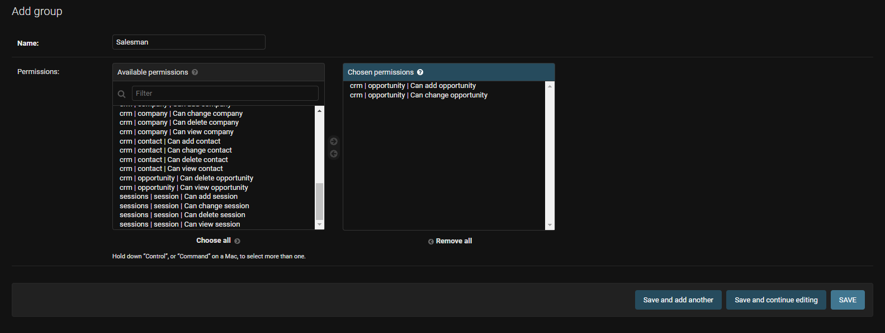
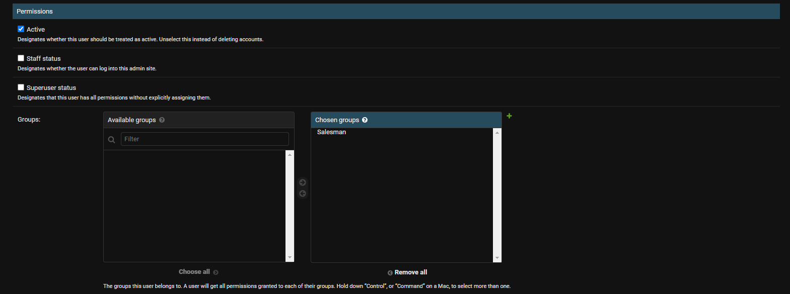
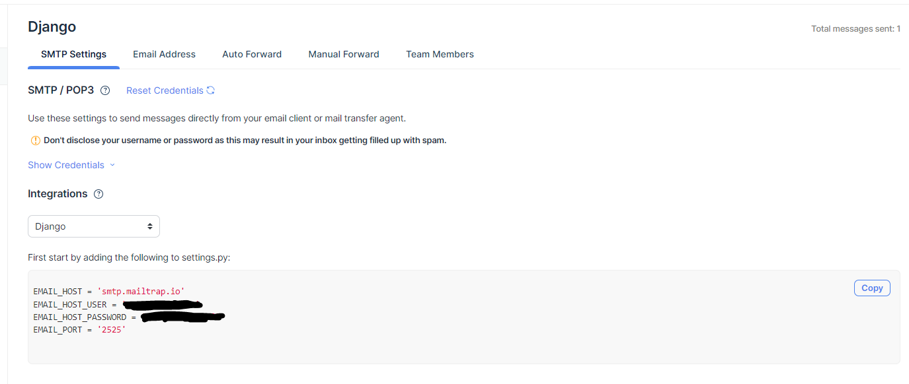

# Přihlašování a uživatelská oprávnění

Většina aplikací umožňuje uživatelům přihlášení. Přihlášení uživatele umožní přístup k funkcím a datům, které jinak nejsou dostupné. V některých případech jsou funkce po přihlášení spíše okrajové (např. možnost přispívat do diskuse na zpravodajském serveru), u dalších aplikací je pak přihlášení nutné (např. u firemních aplikací, aplikací s placeným obsahem atd.).

Samotný systém přihlašování si musí poradit s následujícími činnostmi:

- stránka pro registraci uživatele,
- aktivaci účtu (např. na základě ověření e-mailu),
- stránka pro přihlášení uživatele,
- systém pro reset hesla v případě zapomenutí.

Django dále nabízí řízení práv pro uživatele. Práva jsou přidělována vždy k jednotlivým modelům a ke každému modelu lze nastavit právo prohlížení, vytváření, úpravy a mazání záznamů.

## Přidání adres

Django má několik připravených adres a pohledů, které řeší přihlašování uživatelů. Všechny najednou je můžeme přidat jako položku do seznamu adres v souboru `company_manager/urls.py`. Vložíme je z modulu `django.contrib.auth.urls` pomocí funkce `include`, kterou jsme již použili ke vložení adres z naší aplikace `crm`.

```py
path('accounts/', include('django.contrib.auth.urls')),
```

V následující tabulce jsou adresy, které můžeme v naší aplikaci využít.

| adresa | název adresy | funkce |
|---|---|---|
| `accounts/login/` | `login` | přihlašovací stránka |
| `accounts/logout/` | `logout` | odkaz pro odhlášení |
| `accounts/password_change/` | `password_change` | změna hesla |
| `accounts/password_change/done/` | `password_change_done` | potvrzení změny hesla |
| `accounts/password_reset/` | `password_reset` | reset hesla v případě zapomenutí |
| `accounts/password_reset/done/` | `password_reset_done` | potvrzení o odeslání mailu |
| `accounts/reset/<uidb64>/<token>/` | `password_reset_confirm` | odkaz odeslaný uživateli mailem |
| `accounts/reset/done/` | `password_reset_complete` | potvrzení o odeslání hesla |

## Přihlášení a odhlášení

Základní dvojice úkonů, kterou nyní přidáme, je přihlášení a odhlášení uživatele

### Přihlášení

Jako první přidáme přihlašování. V adresáři `templates` v naší aplikaci `crm` vytvoříme nový adresář `registration`. Tento název musíme dodržet, protože přesně ten název bude Django hledat. Následně do adresáře vložíme soubor `login.html`. V šabloně můžeme využít formulář v proměnné `form`, se kterým jsme již pracovali. Přidáme tlačítko na odeslání a již známé prvky - tag `extends` s odkazem na šablonu `base.html`, ozačení bloku, nadpis a tag `form`. Opět musíme využít metodu `post`, protože uživatelské heslo určitě nechceme mít viditelné v adrese stránky.

```html


<h2>Login</h2>
<form method="post">
    
        {{ form.as_p }}
        <button type="submit" class="btn btn-primary">Přihlásit</button>
</form>

```

Dále musíme vyřešit, kam bude uživatel přesměrován po přihlášení. Nabízí se přirozeně úvodní stránka aplikace. Název adresy, kam má být uživatel přesměrován po přihlášení, vložíme do hodnoty `LOGIN_REDIRECT_URL` v nastavení (soubor `settings.py`).

```py
LOGIN_REDIRECT_URL = "index"
```

### Odhlášení

Uživatel by měl mít možnost se i odhlásit. Odkaz na odhlášení můžeme vložit do navigačního panelu. Aby se nepletl k ostatním položkám, umístíme ho napravo. K tomu využijeme třídu `container-fluid`. Třída `container-fluid` obecně zajistí rozložení prvků v celé šířce obrazovky, takže odkazy s navigačními prvky budou vlevo a odkaz na odhlášení vpravo.

```html
<div class="container-fluid">
    <!-- Tady jsou odkazy v navigačním panelu -->
    <a class="nav-link" href="">Log out</a>
</div>
```

Odkaz na odhlášení by ale měl být zobrazen pouze v případě, že je uživatel přihlášen. Abychom zobrazili odkaz pouze v případě, že je uživatel přihlášen, použijeme podmínku. Podmínku v šablonách zapisujeme do tagu ``. V šabloně máme vždy automaticky k dispozici proměnnou `user` a ta má vlastnost `is_authenticated`. Tato vlastnost má hodnotu `True`, pokud je uživatel přihlášen, a `False` pokud není.

```html

    <a class="nav-link" href="">Log out</a>

```

Nyní se odkaz na odhlášení zobrazí pouze v případě, že je uživatel přihlášen. Můžeme šablonu ještě vylepšit a přidat odkaz na přihlášení, pokud uživatel není přihlášen.

```html

    <a class="nav-link" href="">Log out</a>

    <a class="nav-link" href="">Log in</a>

```

Nakonec je ještě dobré nastavit adresu, kam má být uživatel přesměrován po přihlášení. Název adresy, kam má být uživatel přesměrován po přihlášení, vložíme do hodnoty `LOGOUT_REDIRECT_URL` v nastavení (soubor `settings.py`).

```py
LOGOUT_REDIRECT_URL = "index"
```

## Omezení přístupu k pohledům

Aby mělo přihlašování nějaký smysl, musíme dát přihlášeným uživatelům nějakou funkci navíc. "Šikanování" nepřihlášených uživatelů provádíme na úrovni pohledů. Nepřihlášený uživatel by například rozhodně neměl vidět pohled na firmy či obchodní příležitosti. To zajistíme pomocí tzv. `Mixin`. `Mixin` je třída, kterou můžeme využít v rámci dědičnosti. Pokud bude náš pohled dědit od `LoginRequiredMixin`, může si jen zobrazit pouze přihlášený uživatel.

Mechanismus, který nyní využíváme, je označovaný jako vícenásobná dědičnost. Znamená to, že třídá může mít více rodičů. U pohledu `CompanyListView` tedy ponecháme `ListView` jako jednoho z rodičů a přidáme `LoginRequiredMixin`. Důležité je, že **jakýkoli `Mixin` musí být vždy uveden jako první, protože na pořadí uvedení tříd záleží**!

Po této úpravě pohledu bude nepřihlášený uživatel při otevření stránky přesměrován na přihlašovací formulář.

```py
from django.contrib.auth.mixins import LoginRequiredMixin

class CompanyListView(LoginRequiredMixin, ListView):
    model = models.Company
    template_name = "company/list_company.html"
```

## Uživatelské skupiny

K některým akcím ale přihlášení nemusí stačit. Například můžeme rozhodnout, že založení obchodního případu můžou provést pouze určití uživatelé. Práva k akcím můžeme nastavovat na konkrétní uživatele nebo na uživatelské skupiny. Výhodou skupin je větší přehlednost a možnost snadno měnit nastavení pro více uživatelů.

Skupinu vytvoříme v administrátorském rozhraní. Abychom k němu měli přístup, musíme se nejdříve přihlásit uživatelským jménem administrátora, které jsme vytvářeli příkazem `python manage.py createsuperuser`.



Vytvoříme tedy skupinu `Salesman` a přiřadíme ji práva `crm | opportunity | Can add opportunity` a `crm | opportunity | Can change opportunity`. Následně novou roli přiřadíme nějakému uživateli. Tento uživatel nesmí být administrátor (nesmí mít zaškrtnutou volbu `Superuser status`), protože superuživatel může cokoli :-)



Toto nastavení se do aplikace zatím nepromítne. Resp. samotné nastavení skupin by se projevilo, pokud by uživatel měl přístup do administrátorského rozhaní (tj. měl zaškrtnutou volbu `Staff status`, ale nebyl superuživatel). V takovém případě by v administrátorském rozhraní mohl vidět a měnit pouze to, co má povolené.

Pro naše vlastní pohledy ale musíme omezení nastavit. K tomu nám poslouží `PermissionRequiredMixin`, který funguje podobně jako `LoginRequiredMixin`. U pohledu ale musíme nastavit atribut `permission_required`, kterým říkáme, jaké oprávnění musí uživatel mít, aby si mohl pohled zobrazit.

```py
from django.contrib.auth.mixins import LoginRequiredMixin, PermissionRequiredMixin

class OpportunityCreateView(PermissionRequiredMixin, CreateView):
    permission_required = 'crm.add_opportunity'
    model = models.Opportunity
    template_name = "company/create_company.html"
    fields = ["company", "sales_manager", "primary_contact", "description", "status"]
    success_url = reverse_lazy("index")
```

Pokud uživatel nemá oprávnění na vytvoření obchodního případu, zobrazí se mu po této úpravě následující chyba.


Uživatel, který oprávnění má, nebude pozorovat žádnou změnu.

### Práce s oprávněními v šabloně

Pokud uživatel nemůže otevřít nějakou stránku, je lepší mu odkaz na ni vůbec nezobrazovat. To můžeme vyřešit na úrovni šablony, a to podobným způsobem, jako kontrolovali přihlášení uživatele. Poslouží nám k tomu proměnná `perm`. Ověření, zda má uživatel oprávnění přidat obchodní případ, ověříme podmínkou:

```

```

Tím můžeme uživateli zobrazovat odkazy pouze na stránky, které může otevřít. Díky tomu bude aplikace pro uživatele jednodušší a přehlednější.

Pozor, skrytí odkazu nás nezbavuje nutnosti nastavit práva na pohledu. Pokud bychom pouze adresu stránky skryli, uživatel by ji mohl uhádnout nebo okoukat u kolegy a následně provádět činnost, která mu nepřísluší.

### Nastavení oprávnění na úroveň jednotlivých záznamů

Aktuální nastavení rolí umožňuje pouze povolit nebo zakázat uživateli manipulaci nebo prohlížení všech záznamů nějakého modelu. V některých případech můžeme řešit nastavení na úrovni jednotlivých záznamů. To je důležité například při práci s osobními daty v bankovnictví, zdravotnictví nebo školství.

## Obnovení hesla

Lidé jsou zapomnětliví a může se stát, že někdo z uživatelů zapomene heslo. Djagno umožňuje použít standardní mechanismus změny hesla po ověřené e-mailu. My si zatím připravíme formulář na žádost uživatele o obnovení hesla.

```html


<h2>Password Reset</h2>
<p>Please fillin the e-mail address of your account</p>
<form method="post">
    
        {{ form.as_p }}
        <button type="submit" class="btn btn-primary">Odeslat</button>
</form>

```

Jako druhý krok přidáme stránku, kam chceme uživatele přesměrové poté, co vyplní e-mail.

```html


<h2>Password Reset Finished</h2>

```

E-mail zatím odeslán není, protože nemáme nastavené připojení na server, který e-mail může odeslat.

### Nastavení služby Mailtrap

Ve fázi vývoje je jednodušší a bezpečnější e-maily neodesílat, ale pouze použít nějakou službu, která simuluje odesílání mailů. Příkladem takové služby je služba [Mailtrap](https://mailtrap.io/). Pro použití služby je nutné se nejprve zaregistrovat a oveřit e-mail.

Po přihlášení do aplikace je potřeba vytvořit novou mailovou schránku. K tomu slouží tlačítko `Add Inbox`. Té přiřadíme nějaké jméno (např. `Django`).


Po kliknutí na název schránky vidíme na záložce `SMTP Settings` nastavení schránky pro různá prostředí, která můžeme rovou překopírovat. Ve dlouhém seznamu nechybí `Djano`. Nastavení má pouze čtyři řádky, které zkopírujeme do souboru `settings.py`.



Nyní můžeme znovu vyzkoušet reset mailu. Pokud máme správně zkopírované nastavení a použijeme reset na adresu, kterou má nastavenou nějaký uživatel, zobrazí se v naší schránce e-mail. V něm vidíme text, který by byl odeslán uživateli. E-mail obsahuje stručný text a unikátní odkaz, který umožní zapomnětlivému uživateli nastavit nové heslo.


# Cvičení

## Úprava obchodního případu

Umožni uživatelům úpravu obchodní případů s tím, že ji smějí provádět pouze členové skupiny `Salesman`.

- Vytvoř pohled `OpportunityUpdateView`, který bude sloužit k úpravě informací o obchodním případu. Pohled má stejné atributy jako `OpportunityCreateView`, tj. `model`, `template_name`, `fields` a `success_url`.
- Vytvoř k němu šablonu. Jako základ můžeš použít šablonu `create_opportunity.html`, nezapomeň na případnou úpravu nadpisu, aby uživatel nebyl zmatený.
- Vytvoř adresu pro tento pohled. Zde je potřeba do URL adresy vložit ID obchodního případu, který chceš upravovat. První parametr funkce `path()` při vytváření nové adresy by tedy mohl vypadat například takto: `'opportunity/update/<int:pk>'`.
- Pomocí `PermissionRequiredMixin` omez přístup k pohledu pouze pro uživatele, kteří mají právo upravovat obchodní případy.

## Bonus: Bezpečné uložení nastavení e-mailu

Ze čtyř informací, které používáme k nastavení e-mailu, jsou minimálně dvě citlivé (`EMAIL_HOST_USER`, `EMAIL_HOST_PASSWORD`). Přesto se ale může hodit používat službu Mailtrap ve vývojovém prostředí a na produkčním serveru používat skutečný server pro odesílání pošty. Aby to bylo možné, přenes nastavení e-mailu do souboru `.env` a jejich hodnoty načti s využitím modulu `python-decouple`.
