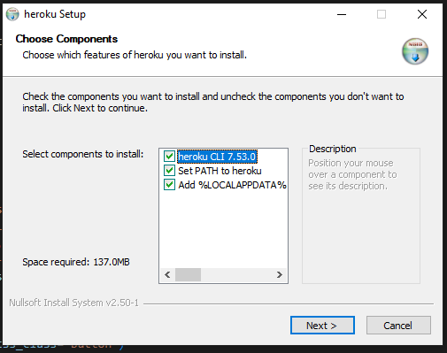

# Modul django-crispy-forms

Pokud bychom chtěli výrazně upravit vzhled formuláře, můžeme použít modul `django-crispy-forms`. Ten umožní rozvrhnout formulář a nastavit mu konkrétní CSS třídy přímo ve třídě formuláře, což je většinou přehlednější než nastavení vzhledu v šabloně. K modulu `django-crispy-forms` existuje další užitečný modul, a to `crispy-bootstrap5`, který je vyladěný speciálně pro Bootstrap 5

Moduly je potřeba nejprve nainstalovat, a to přes vývojové prostředí nebo příkazem

```
pip install django-crispy-forms
pip install crispy-bootstrap5
```

Moduly musíme přidat do seznamu `INSTALLED_APPS`.

```py
INSTALLED_APPS = (
    ...
    "crispy_forms",
    "crispy_bootstrap5",
    ...
)
```

Následně nastavíme konstanty `CRISPY_TEMPLATE_PACK` a `CRISPY_ALLOWED_TEMPLATE_PACKS`, též v souboru `settings.py`.

```py
CRISPY_ALLOWED_TEMPLATE_PACKS = "bootstrap5"

CRISPY_TEMPLATE_PACK = "bootstrap5"
```

Následně přidáme metodu `__init__()` ke třídě `CompanyForm`. Následně vkládáme třídy `Div()`, které vytváření HTML tagy `<div>` v samotné šabloně. Vytvoříme jeden tag `Div()`, kterému nastavíme atribut `css_class` na hodnotu `row` - ten symbolizuje jeden "řádek" v šabloně. Následně vložíme samostatné `Div()` pro každé pole formuláře. Na první místo vložíme název pole a dále jako parametr `css_class` vložíme třídu, která bude definovat šířku pole.

```py
from crispy_forms.helper import FormHelper
from crispy_forms.layout import Layout, ButtonHolder, Submit, Div


class CompanyForm(ModelForm):

    def __init__(self, *args, **kwargs):
        super().__init__(*args, **kwargs)
        self.helper = FormHelper()
        self.helper.layout = Layout(
            Div(
                Div("name", css_class="col-sm-4"),
                Div("status", css_class="col-sm-2"),
                Div("identification_number", css_class="col-sm-4"),
                Div("email", css_class="col-sm-4"),
                Div("phone_number", css_class="col-sm-4"),
                css_class="row",
            ),
            ButtonHolder(
                Submit('submit', 'Submit', css_class='button')
            )
        )

```

# Deployment na Heroku

Nyní vyzkoušíme nahrání aplikace na server, aby byla dostupná uživatelům. Využijeme službu [Heroku](https://www.heroku.com/home), která nabízí základní verzi služby zdarma. Do služby je nutné se zaregistrovat, což lze provést na [této stránce](https://signup.heroku.com/) a následně se přihlásit. Dále je potřeba nainstalovat **klienta** pro příkazový řádek Heroku CLI. Na [této stránce](https://devcenter.heroku.com/articles/heroku-cli) jsou k dispozici instalační soubory a návody pro Windows, MacOS i Linux. Před instalací klienta je potřeba mít nainstalovaného [Git klienta](https://git-scm.com/book/en/v2/Getting-Started-Installing-Git).

Při instalaci na Windows je potřeba **nechat zaškrtnuté** všechny možnosti v prvním okně instalačního průvodce.



Řádnou instalaci klienta ověříme zadáním příkazu

```
heroku --version
```

do termínálu. Pokud je vše v pořádku, zadáme příkaz

```
heroku login
```

Tímto příkazem se přihlásíme do klienta. Přihlášení probíhá prostřednictvím webového prohlížeče. Po stisknutí libovélné klávesy se otevře okno webového prohlížeče, kde potvrdíme přihlášení kliknutím na tlačítko. Přihlášení lze ověřit příkazem

```
heroku auth:whoami
```

Aplikaci můžeme vytvořit pomocí příkazu

```
heroku create
```

Pokud chceme nastavit, jaký název by naše aplikace měla mít a jakou by měla mít doménu 3. řádu, zadáme název jako parametr. Název musí být v rámci služby Heroku unikátní. Pokud zadáme název, který není unikátní, aplikace  nás na to upozorní.

```
heroku create company-manager-jirka
```

Řádné vytvoření aplikace můžeme zkontrolovat příkazem:

```
heroku apps
```

Následně musíme v našem projektu vytvořit soubor `runtime.txt`, který označí verzi Pythonu, se kterou by naše aplikace měla běžet.

```
runtime.txt
```

Do souboru můžeme vložit například následující řádek

```
python-3.9.6
```

Soubor musíme přidat do Gitu.


Následně vytvoříme soubor `Procfile`, který bude obsahovat příkaz, pomocí kterého je aplikace spuštěna.

```
web: python company_manager/manage.py runserver 0.0.0.0:$PORT
```

Jednotlivé konfigurační hodnoty je možné nastavit pomocí příkazu `heroku config`. Můžeme pomocí něj nastavit `SECRET_KEY`. Ten může být klidně jiný, než jaký používáme na lokální vývoj. Nejprve si můžeme nový `SECRET_KEY` vygenerovat.

```py
from django.core.management.utils import get_random_secret_key
print(get_random_secret_key())
```

A následně ho uložíme do služby `heroku`.

```
heroku config:set SECRET_KEY="#=+@u3v6d-hj1j9n90(move#@lrw!&17w*pwx09(zeqfjl2386"
```

Dále je potřeba doinstalovat modul `django-heroku`

```
pip install django-heroku
```

**Na konec** souboru s nastavením `settings.py` vložíme následující řádky, které zajístí nahrání konfiguračních hodnot z Heroku.

```py
import django_heroku

django_heroku.settings(locals())
```

Spuštění můžeme otestovat pomocí příkazu

```
heroku local --port=8000
```

Pokud by příkaz nefungoval (především na Windows), je možné dočasně nahradit vložení proměnné `$PORT` číslem `8000`.

```
git push heroku master
```

## Nastavení databáze

Zadáme-li příkaz

```
heroku addons
```

uvidíme, že doplňkem naší aplikace je `heroku-postgresql`, tedy databáze PostgreSQL. Vygenerování a nastavení aplikace provádí služba Heroku automaticky. Nastavení můžeme zkontrolovat příkazem

```
heroku config
```

Výstupem příkazu je kromě námi přidaného `SECRET_KEY` i řetězec `DATABASE_URL`, což je adresa naší databáze (včetně hesla).

```
=== company-manager-jirka Config Vars
DATABASE_URL: postgres://XX:XX@ec2-54-165-184-219.compute-1.amazonaws.com:5432/XX
SECRET_KEY:   XX
```

Stav databáze můžeme zkontrolovat příkazem

```
heroku pg
```

Dále potřebujeme provést migraci databáze. K tomu, abychom mohli spouštět pro aplikaci na vzdáleném serveru příkazy, můžeme použít příkaz `heroku run`, za který přidáme příkaz, který chceme spustit.

```
heroku run python company_manager/manage.py migrate
```

Tento krok můžeme i automatizovat, a to tím, že jej přidáme jako další řádek do souboru `Procfile`

```
web: python company_manager/manage.py runserver 0.0.0.0:$PORT
release: python company_manager/manage.py migrate
```


```
heroku run bash
```

```
python company_manager/manage.py createsuperuser
```

```py
CSRF_TRUSTED_ORIGINS = [
    "https://company-manager-jirka.herokuapp.com"
]
```

# Cvičení

## Deployment projektu

Proveď deployment svého projektu na službu Heroku.

- Projekt musí být nahraný na Gitu. Pokud ho nahraný nemáš, nahraj ho do nového repozitáře.
- Vytvoř aplikaci s novým jménem pod svým účtem.
- Proveď všechny úpravy a příkazy, které jsme prováděli v rámci lekce, a zkontroluj, že projekt byl řádně nahrán.
